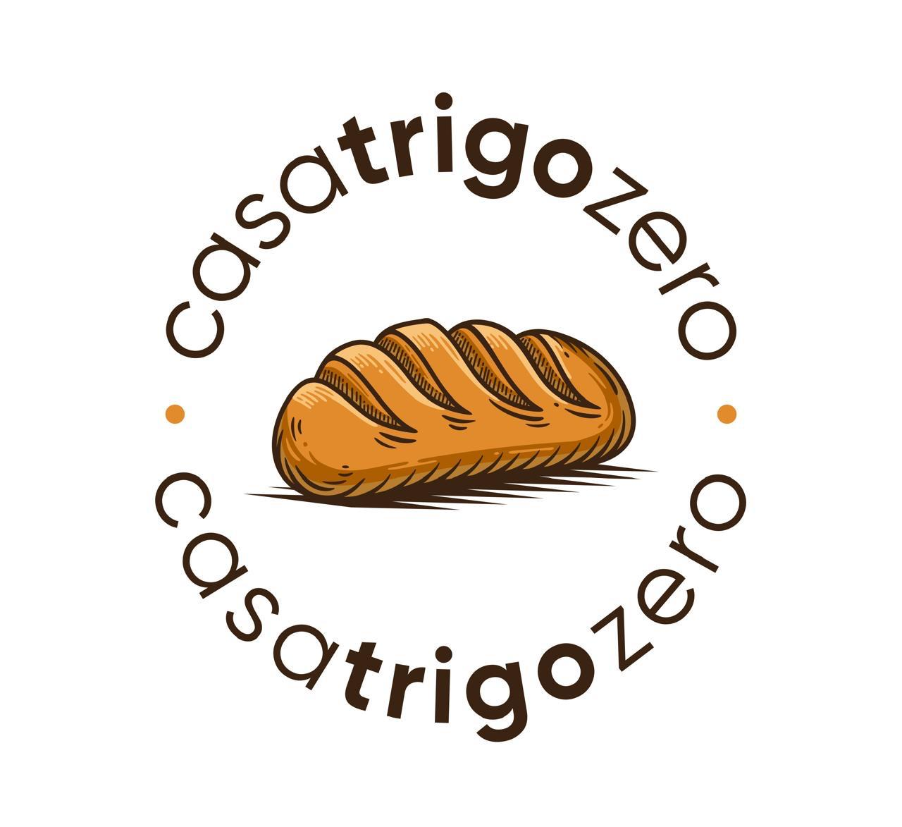

<div align="center">



# Casa Trigo Zero

**Landing page institucional para padaria artesanal sem glúten e sem leite.**

[](https://casatrigozero.com)
[](.)
[](.)
[](.)
[](.)
[](.)

</div>

---

## Visão Geral

Site institucional desenvolvido para a **Casa Trigo Zero**, padaria artesanal localizada em Lucas do Rio Verde, MT. O projeto tem como objetivo apresentar a marca, destacar os produtos do cardápio e facilitar o contato e realização de pedidos.

> **Cliente real · Domínio próprio · Em produção**

---

## Seções

| Seção | Descrição |
|---|---|
| `Hero` | Chamada principal com foto da fachada, tags e botões de CTA |
| `#produtos` | Cards dos produtos em destaque com link direto para o cardápio |
| `#diferenciais` | Proposta de valor da marca: ingredientes, produção e atendimento |
| `#instagram` | Feed integrado via Elfsight com posts recentes do perfil |
| `#pedido` | CTA de encomendas com link para o sistema de pedidos online |
| `#contato` | Rodapé com endereço, WhatsApp, e-mail e mapa incorporado |

---

## Funcionalidades

- 📱 **Layout responsivo** — adaptado para mobile e desktop
- ✨ **Animações de entrada** — elementos revelados via `IntersectionObserver`
- 🍞 **Cards de produtos** — com imagem, descrição e link para o cardápio
- 📦 **Sistema de pedidos** — integração com [anota.ai](https://pedido.anota.ai/loja/trigo-zero?f=ms)
- 📸 **Feed do Instagram** — widget embutido via Elfsight
- 🗺️ **Mapa incorporado** — localização via Google Maps iframe
- 🔗 **WhatsApp direto** — link de contato rápido no footer e na navbar
- 📅 **Ano dinâmico** — copyright atualizado automaticamente via JS
- ☰ **Menu mobile** — hambúrguer com acessibilidade (`aria-expanded`)

---

## Stack

| Tecnologia | Uso |
|---|---|
| `HTML5` | Estrutura semântica com acessibilidade e SEO básico |
| `CSS3` | Layout responsivo, variáveis, animações e bg-shapes decorativos |
| `JavaScript Vanilla` | Menu mobile, reveal on scroll, ano automático |
| `Fraunces` | Fonte serif para títulos — identidade artesanal |
| `Manrope` | Fonte sans para corpo de texto — leitura confortável |
| `Elfsight` | Widget de feed do Instagram embutido |
| `Google Maps` | Mapa de localização via iframe |
| `GitHub Pages` | Deploy estático com domínio customizado `casatrigozero.com` |

---

## Estrutura

```
casatrigozero/
├── index.html         # Estrutura completa da landing page
├── style.css          # Todos os estilos, temas e responsividade
├── script.js          # Menu mobile, IntersectionObserver, ano dinâmico
├── logocirculo.png    # Logo circular da marca
├── fachada.png        # Foto da fachada — hero section
├── paocenoura.png     # Produto: Pão de Cenoura
├── torta.png          # Produto: Torta de frango com mussarela vegetal
├── cuca.png           # Produto: Cuca de Uva
├── paobrioche.png     # Produto: Pão Brioche — seção de diferenciais
├── favicon.ico        # Ícone da aba do navegador
└── CNAME              # Domínio customizado casatrigozero.com
```

---

## Rodando Localmente

```bash
# Clone o repositório
git clone https://github.com/pixelbarz/casatrigozero.git

# Entre na pasta
cd casatrigozero

# Suba um servidor local
python3 -m http.server 3000
# → http://localhost:3000
```

> O feed do Instagram (Elfsight) requer conexão com a internet para carregar. As demais funcionalidades funcionam offline normalmente.

---

## Links do Projeto

| Recurso | URL |
|---|---|
| 🌐 Site em produção | [casatrigozero.com](https://casatrigozero.com) |
| 🛒 Cardápio / Pedidos | [pedido.anota.ai/loja/trigo-zero](https://pedido.anota.ai/loja/trigo-zero?f=ms) |
| 📷 Instagram | [@casatrigozero](https://www.instagram.com/casatrigozero/) |
| 💬 WhatsApp | [+55 65 8474-2600](https://wa.me/+556584742600) |
| 📍 Localização | [Rua Mogno, 1143 — Lucas do Rio Verde, MT](https://maps.app.goo.gl/H6GDWr77mRo4hFcE7) |

---

## Desenvolvido por

**José Braz (pixelbarz)** — Front-end Developer

[josebraz.cc](https://josebraz.cc) · [github.com/pixelbarz](https://github.com/pixelbarz)

---

<div align="center">

© 2026 Casa Trigo Zero · Todos os direitos reservados.

</div>
